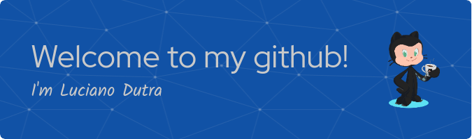

<h3> 👨🏻 </h3>
<h3>•💻 About me! </h3>

- 🤔 &nbsp; Graduated in civil engineering, but looking for a professional accomplishment in the area of web development.

- 🎓 &nbsp; currently i am student at Trybe.

- 🌱 &nbsp; Future Full-Stack developers.

- ✍️ &nbsp; objective of being able to help people through technology..

<h3>🛠 Technologies:</h3>

- 💻 &nbsp; JavaScript | Python |

- 🌐 &nbsp; HTML | CSS | Bootstrap | jQuery | ReactJS | Redux | Git | GitHub | Testes: Jest, react-testing-library | Metodologias ágeis: Scrum, Kanban  

 

<!--

- 🛢 &nbsp; MySQL | MongoDB

- 🔧 &nbsp; Git | Markdown | Selenium | Tidyverse

- 🖥 &nbsp; Illustrator| Photoshop | InDesign

-->

<h3>🛠 To Learn</h3>

- 🔧 &nbsp; Docker | SQL | JOIN | Node.js | TypeScript | POO - Programação Orientada a Objetos | SOLID | MongoDB

  

 

 

  

<h3> 🤝🏻 Reach me! </h3>

 

 
lucianoo_dutra@hotmail.com

